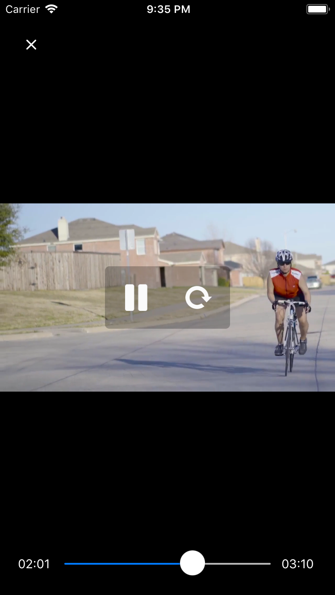

<h1 align="center">
  React Native True Sight
</h1>
<p align="center">
  
</p>
<h4 align="center">A cross-platform video player with customizable controls.</h4>

<br>

This library provide a fully customisable video player that work both on Android and iOS. It also come with common use case documentation of things that you would like to implements.

By default there are two controls slots that are displayed respectively on different part of the parent container and you can use default components provided by this library:

- **Middle**. Contain by default a grid display two buttons:
  - One with play / pause alternating.
  - Another that will restart the video.
- **Bottom**. Contain the video current time, a progress bar and the total duration.
- **Loader**. There is also a loader that will trigger while video is charging (network issues, bootstraping, ...).

## Documentation

- [Installation chapter](./doc/install.md)
- [Render a FullScreen Video player](./doc/full-screen-player.md)
- [Implement your own controls bar](./doc/custom-controls-bar.md)

# Quick documentation

This is simple as that.

VideoPlayer ship around any video component, but fits well with react-video. In v2 you've total control on the video component.

- **autoStart** - Whether or not the video should start when rendered (Default to true).
- **mainControl** - The component used to render the main control bar, you can use the default one provided by this lib or your own.
- **bottomControl** - The component used to render the bottom control bar, you can use the default one provided by this lib or your own.

For advanced configuration, such as infinite loop, check the rest of the documentation and custom controls bar.

```jsx
import React, { Component } from "react";
import { View } from "react-native";
import Video from "react-native-video";
import { VideoPlayer, DefaultMainControl, DefaultBottomControlsBar } from "react-native-true-sight";

export default class HomeScreen extends Component {
  render() {
    return (
      <VideoPlayer
          autoStart={false}
          mainControl={args => <DefaultMainControl {...args} />}
          bottomControl={args => <DefaultBottomControlsBar {...args} />}
        >
          {args => (
            <Video
              ref={args.playerRef}
              source={{ uri: data.videoUrl }}
              paused={args.videoPaused}
              onLoad={args.onLoad}
              onProgress={args.onProgress}
              onEnd={args.onEnd}
            />
          )}
        </VideoPlayer>
    );
  }
}
```
